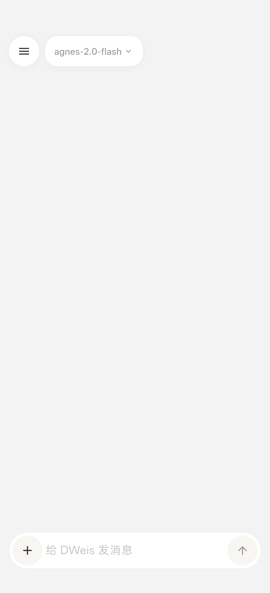
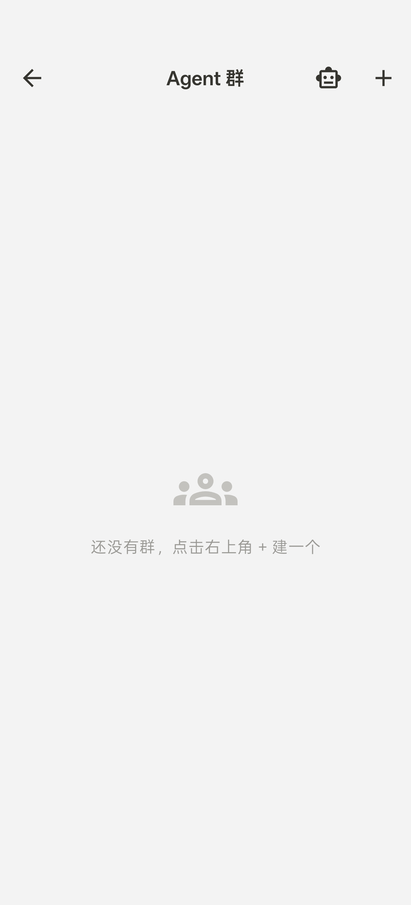
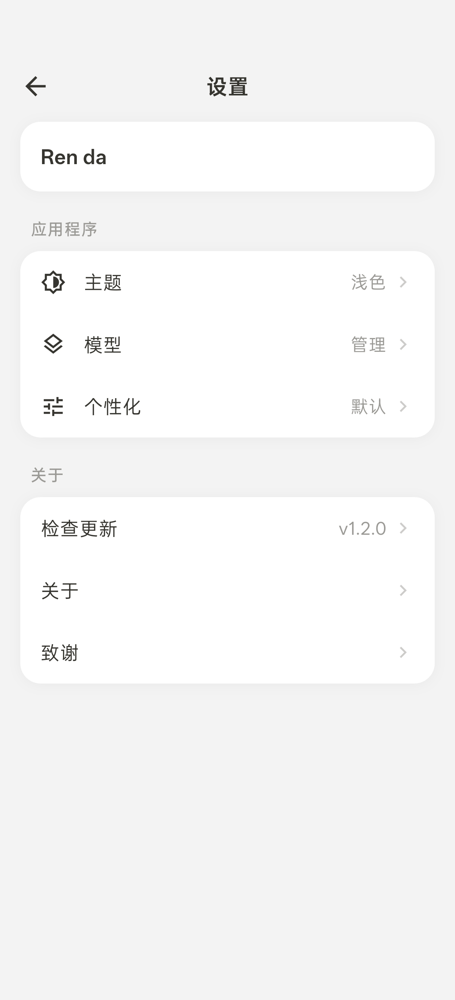

# personal-agent-app

[](https://flutter.dev)
[](https://dart.dev)
[](LICENSE)

一个功能丰富的 Android AI 助理应用，支持多 Agent 团队协作、多后端 AI 对话、13 种工具调用、记忆系统等，基于 Flutter 构建（仅 Android 平台）。

---

## ✨ 功能特性

### 🤖 Agent 群（Agent 团队协作）
- **多 Agent 协作** — 像真实团队一样，不同职能的 AI Agent 在群里讨论、接力完成任务
- **协调者 Agent** — DWeis Agent 常驻响应，自动拆解任务、按需求分派给合适的 Agent
- **审核/封驳机制** — 复杂方案必须经群主确认后才执行，质量有保障
- **通信矩阵** — Agent 优先通过协调者调度，避免消息风暴
- **Agent 间接力** — 完成任务的 Agent 可 @ 下一个继续，形成工作流
- **自定义 Agent** — 自由创建 Agent，独立配置 system prompt、工具白名单、AI 后端
- **严格工具隔离** — Agent 只能调只读类工具，不会污染用户数据
- **Agent 间相互引用** — Agent 能看到同伴的发言，可以说"我同意产品经理的分析"

### 💬 AI 对话
- 支持 **OpenAI / Anthropic / DeepSeek / Agnes** 等多种 AI 后端
- 流式输出 + 工具调用（Function Calling）
- 多会话管理，聊天记录本地持久化

### 🛠️ 工具调用
AI 可调用 13 个内置工具：
- 天气查询、网页搜索、网页内容抓取
- 图片生成、视频生成（Agnes AI）
- 笔记管理、记忆系统、定时提醒
- 日历集成、文件管理、剪贴板操作

### 🧠 记忆系统
- AI 记住用户偏好和重要事实
- 个性化回复风格（默认/简洁/详细/幽默/专业）
- 自定义指令

### 🎨 其他特性
- 亮色/暗色主题，400ms 颜色补间动画
- 每日 AI 问候卡片（聚合天气+日程+记忆）
- 笔记管理、媒体库
- 仅 Android 平台

---

## 📸 截图

| 聊天对话 | Agent 群协作 | 设置页面 |
|:---:|:---:|:---:|
|  |  |  |

---

## 🚀 快速开始

### 环境要求

- Flutter SDK >= 3.11.5
- Dart SDK >= 3.11.5

### 安装

```bash
# 克隆项目
git clone https://github.com/3d-jq/personal-agent-app.git
cd personal-agent-app

# 安装依赖
flutter pub get

# 运行
flutter run
```

### 配置 AI 后端

首次启动时在设置中配置 AI 后端。支持：

| 厂商 | Base URL | 说明 |
|------|----------|------|
| DeepSeek | `https://api.deepseek.com/v1` | 国内推荐，性价比高 |
| OpenAI | `https://api.openai.com/v1` | GPT-4o 等模型 |
| Anthropic | `https://api.anthropic.com` | Claude 系列 |
| Agnes | `https://apihub.agnes-ai.com/v1` | 图片/视频生成 |

也支持其他兼容 OpenAI API 格式的服务商。

---

## 🏗️ 架构

```
lib/
├── main.dart                    # 入口
├── app.dart                     # 应用根（主题、动效背景）
├── core/agent_colors.dart       # 设计系统（暖灰色调）
├── models/                      # 数据模型
│   ├── agent.dart               # Agent 定义
│   ├── agent_group.dart         # Agent 群定义
│   ├── chat_message.dart        # 消息模型
│   ├── chat_session.dart        # 会话模型
│   └── ...
├── services/                    # 服务层（单例 + 本地 JSON 持久化）
│   ├── ai_service.dart          # AI 通信（OpenAI/Anthropic 流式）
│   ├── agent_runner.dart        # Agent 执行器
│   ├── agent_storage.dart       # Agent CRUD
│   ├── agent_group_storage.dart # 群 CRUD
│   ├── memory_storage.dart      # 记忆系统
│   └── ...
├── tools/                       # 13 个 Agent 工具
│   ├── tool_registry.dart       # 工具注册中心
│   ├── weather_tool.dart        # 天气查询
│   ├── web_search.dart          # 网页搜索
│   └── ...
├── widgets/                     # UI 组件
│   ├── agent_group/             # Agent 群相关 UI
│   │   ├── group_chat_screen.dart
│   │   ├── group_list_page.dart
│   │   ├── group_edit_page.dart
│   │   └── agent_manage_page.dart
│   └── ...
└── screens/                     # 页面
    ├── chat_screen.dart         # 主聊天页
    └── ...
```

### 设计理念

- **数据驱动** — Agent 的协调者身份用 `isCoordinator` 字段控制，不硬编码名字
- **严格隔离** — Agent 只能调只读工具（方案 A），用户数据零污染
- **本地优先** — 所有数据 JSON 文件本地存储，带损坏备份机制
- **缓存策略** — 存储层内存缓存 + AsyncLock 串行化写操作

---

## 📦 技术栈

| 类别 | 技术 |
|------|------|
| 框架 | Flutter 3.11+ |
| 网络 | Dio |
| 本地存储 | path_provider + JSON |
| Markdown | flutter_markdown |
| 通知 | flutter_local_notifications |
| 文件选择 | file_picker |
| 网络状态 | connectivity_plus |
| 安装 APK | open_filex |
| 权限管理 | permission_handler |

---

## 🔨 构建发布

```bash
# Android APK
flutter build apk --release
```

---

## 📝 更新日志

### v0.6.5
- 🎨 输入框重写：单行胶囊 / 多行展开无缝切换，键盘不收起
- 🐛 修复暂停后工具步骤仍转圈的问题
- 💄 侧边栏当前会话增加加载转圈指示器
- 💬 输入框底部增加"大模型也会出错，请谨慎核对内容"提示
- 🧠 提示词工程优化 — XML结构化 + 记忆筛选 + 消息截断

### v0.6.4
- ✨ 新增 `manage_notes` 工具：AI 可列出 / 修改 / 删除已有笔记
- ✨ 新增 `manage_memory` 工具：AI 可列出 / 修改 / 删除已有记忆
- 🧠 system prompt 补充增删改查指引，避免 AI 凭空假设内容

### v0.6.3
- ✨ 集成 SearXNG 自托管搜索（免费替代 Tavily），优先使用 / 失败回退
- 🎨 版本号统一到 AppConfig 常量，设置页 & 关于页自动同步

### v0.6.2
- 🧠 强化工具调用铁律，system prompt + 4 个工具描述禁 AI 幻觉
- 🐛 修复 connectivity_service 适配 connectivity_plus 6.x，恢复断网检测
- ⚡ ListView 加 cacheExtent，imageUrls 正则缓存，去掉每轮重跑系统提示词
- ✨ NoteStorage / MemoryStorage / ReminderStorage 加通知机制，UI 自动刷新
- ✅ 修复 models_test / tools_test，恢复 12 个测试

### v0.6.0
- ✨ Agent 群功能上线：多 Agent 协作、协调者、审核机制、通信矩阵
- ✨ Agent 相互引用同伴观点
- ✨ 自定义 Agent（独立 prompt / 工具 / AI 后端）
- ✨ 设置页检查更新
- 🐛 修复 Agent 身份混淆
- 🐛 修复流式输出 UI 不更新
- 🐛 修复 Stop 按钮无效
- 🎨 统一群聊输入框与主界面风格
- ⚡ System prompt 缓存优化
- ⚡ 消息窗口截断（最多 50 条）

### v0.2.0
- 多 AI 后端支持
- 工具调用系统
- 记忆系统
- 个性化配置

---

## 🤝 贡献

欢迎提交 Issue 和 PR！

## 📄 License

MIT

## ⚠️ 隐私说明

- 所有数据存储在本地设备上
- API Key 仅用于调用 AI 服务
- 聊天记录、笔记等不会被收集或上传
